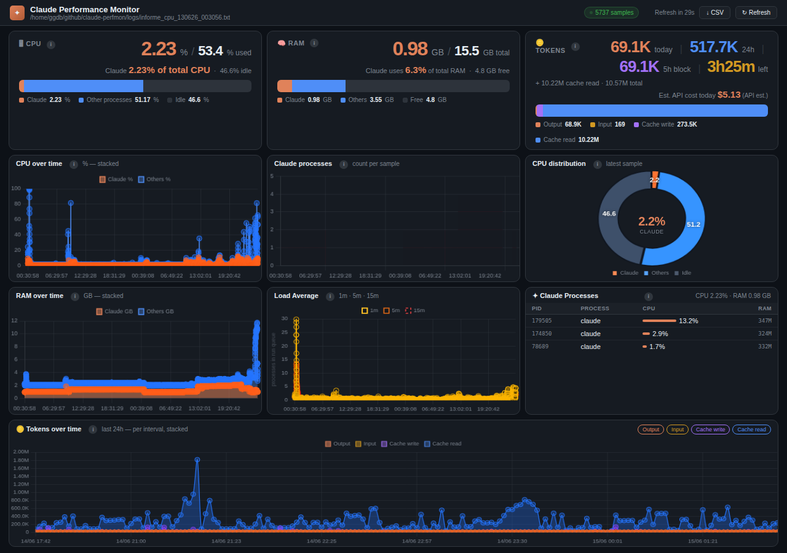

Once you've been using [Claude Code](https://claude.ai/code) daily for a while, token consumption stops being an abstraction. Every token counts toward three things: what fits in the **context window**, the **cost** (if you pay per API), and the **usage limits** of the 5-hour windows (if you're on a subscription plan). The good news is that a handful of habits cut consumption noticeably without sacrificing quality. These are the practices that have worked best for me.

## Monitor your usage (measure before you optimise)

You can't optimise what you don't measure. Monitoring consumption regularly lets you spot patterns —which tasks spike token usage, when the context fills up— and adjust how you work. Some concrete ways to do it:

- **`/context`** — visualises the state of your context window as a grid, with suggestions when something (memory files, tool outputs) takes up too much room.
- **`/cost`** — shows the token usage and estimated cost of the current session.
- **[`ccusage`](https://github.com/ryoppippi/ccusage)** — a community tool that reads Claude Code's local logs and breaks usage down by day, month, or session. Run `npx ccusage@latest` for a summary, and `npx ccusage blocks --live` for a real-time monitor of the 5-hour window.
- **My own tool, [claude-perfmon](https://github.com/gerardo-garcia/claude-perfmon)** — a *fork* of [joobid's original project](https://github.com/joobid/claude-perfmon) (built for macOS) that I adapted to run on WSL. It monitored Claude's CPU and RAM, and for this article I added a **token panel**: it reads the same transcript logs (`~/.claude/projects/**/*.jsonl`), aggregates today's tokens and the current 5-hour block, estimates cost per model, and plots the time series. No external dependencies, just Python.

Any of these gives you a clear picture of where your tokens are going, which is the starting point for everything else.

## Use the right model for the task

Not every task needs the most capable — and most expensive — model. For simple work — drafting a short message, answering a quick question, summarising a paragraph — a lighter model handles it at a fraction of the cost. Save heavier models for reasoning-intensive tasks where it actually makes a difference. In Claude Code you can switch models at any time with `/model`.

## Use plan mode for large tasks

Plan mode doesn't reduce tokens by itself —planning also consumes them— but its saving is **indirect and very real**: validating the approach before touching code avoids the most expensive scenario, which is implementing in the wrong direction and having to redo it. On large tasks, a few planning tokens save many rewriting ones.

## Give enough context in your prompts

It sounds counterintuitive, but **giving more context usually consumes fewer tokens** in the long run. A vague prompt triggers back-and-forth: Claude asks for clarification, explores more than needed, or heads in the wrong direction — and every one of those turns costs tokens. If you state the relevant file, the expected outcome, and the constraints up front, you reach the solution in fewer turns.

## Avoid attaching large files

Attaching files looks like a convenient shortcut, but the cost adds up quickly. PDFs are the worst case: Claude reads and encodes the entire document — potentially thousands of tokens in one shot — before any real work starts. If you need Claude to work with a document, extract the relevant sections as text, or point it to a specific file path that it can read on demand. Reserve attachments for cases where the whole file is genuinely needed.

## Leverage summarisation and compaction

Long conversations accumulate history that gets resent on every turn. When a session drags on, use **`/compact`** to condense the conversation into a summary (you can instruct it on what to keep). Claude Code also compacts automatically when the context fills up. Compacting in time keeps the context lean and focused on what matters now.

## Use memory — wisely

The `CLAUDE.md` file acts as persistent project memory: it saves you from re-explaining the architecture, commands, or conventions every session (you can jot down quick notes with the `#` shortcut). It's one of the best investments to avoid repeating yourself.

With one important caveat, though: `CLAUDE.md` **is loaded every session and takes up context**. It's a trade-off — store what genuinely saves repetition and keep it concise; a giant memory file works against you.

## Build tools for specific tasks

For recurring or deterministic actions, your own tool (a script, an MCP server) is almost always cheaper than walking Claude through it step by step. You offload the mechanical work to code that runs once, instead of spending tokens describing and reasoning about every action. A concrete example: I built a Python tool to manage access and run commands against all our lab environments — private and public clouds, Kubernetes clusters, OSM endpoints, and AI endpoints. Once the tool existed, Claude could lean on it to deploy VMs, create clusters, run OSM tests, or query AI endpoints directly, without having to reason about authentication, connectivity, or environment-specific quirks on every request.

## Create custom skills and commands

If you find yourself repeating the same instructions —the same review flow, the same commit format, the same kind of analysis— turn it into a **custom command** or a **skill**. You encapsulate the instructions once and invoke them with a single line, instead of rewriting them (and resending them as tokens) every time. Skills also load on demand, so they don't weigh anything until you use them.

## Three extra high-impact habits

Beyond the list above, three habits make a disproportionate difference:

- **`/clear` between unrelated tasks.** When you switch topics, the previous history no longer helps yet still gets resent on every turn. Clearing the context when you start something new is probably the simplest, biggest saving there is.
- **Take advantage of _prompt caching_.** Claude Code automatically caches the start of the context (things like `CLAUDE.md` and files you've already read). Keeping that start stable maximises cache hits —which are billed far cheaper than fresh tokens—; conversely, changing something early in the context invalidates the cache and makes the turn more expensive.
- **Ask for terse responses.** Output tokens are billed at a higher rate than input tokens, so trimming Claude's answers is worth it. You can instruct Claude — in `CLAUDE.md` or directly in a prompt — to skip preambles, skip closing summaries, and get straight to the point. An extreme but effective variant: ask it to respond in *caveman style* — short sentences, no filler. You get the answer without the packaging.

## In short

Managing tokens isn't about penny-pinching — it's about **working with intent**: measure to know where you stand, pick the right model, give good context, avoid bulk attachments, compact and clear when it's time, remember what truly matters, and automate the repetitive. They're small habits, but together they cut consumption and, as a bonus, make Claude work better.
